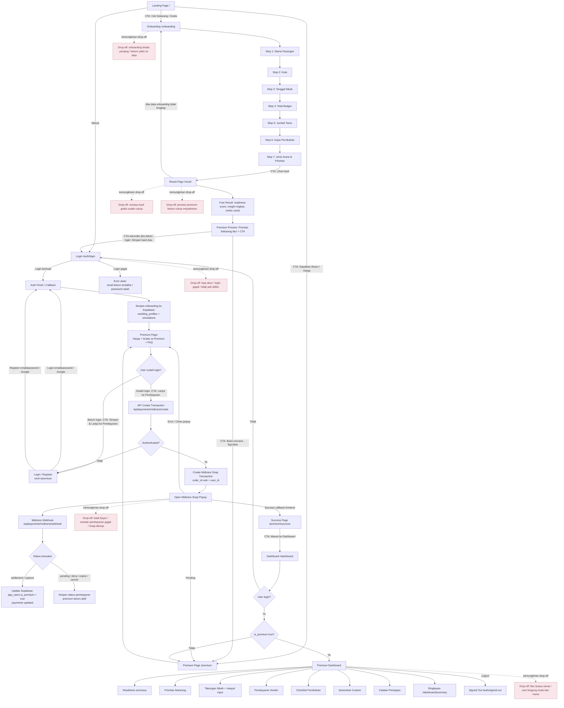

# BudgetNikah User Flow

```mermaid
flowchart TD
  A["Landing Page /"] -->|CTA: Cek Sekarang / Gratis| B["Onboarding /onboarding"]
  A -->|CTA: Dapatkan Akses / Harga| P["Premium Page /premium"]
  A -->|Masuk| L["Login /auth/login"]

  B --> B1["Step 1: Nama Pasangan"]
  B1 --> B2["Step 2: Kota"]
  B2 --> B3["Step 3: Tanggal Nikah"]
  B3 --> B4["Step 4: Total Budget"]
  B4 --> B5["Step 5: Jumlah Tamu"]
  B5 --> B6["Step 6: Gaya Pernikahan"]
  B6 --> B7["Step 7: Jenis Acara & Prioritas"]
  B7 -->|CTA: Lihat Hasil| R["Result Page /result"]

  B -. kemungkinan drop-off .-> D1["Drop-off: onboarding terlalu panjang / belum yakin isi data"]

  R --> R1["Free Result: readiness score, insight ringkas, metric cards"]
  R1 --> R2["Premium Preview: Prioritas Sekarang blur + CTA"]
  R2 -->|CTA sekunder jika belum login: Simpan hasil dulu| L
  R2 -->|CTA: Buka rencana - Rp149rb| P
  R -->|Jika data onboarding tidak lengkap| B

  R -. kemungkinan drop-off .-> D2["Drop-off: merasa hasil gratis sudah cukup"]
  R -. kemungkinan drop-off .-> D3["Drop-off: preview premium belum cukup meyakinkan"]

  P --> P2["Premium Page:\nHarga + Gratis vs Premium + FAQ"]
  P2 --> P1{"User sudah login?"}
  P1 -->|Belum login, CTA: Simpan & Lanjut ke Pembayaran| L2["Login / Register\nnext=/premium"]
  P1 -->|Sudah login, CTA: Lanjut ke Pembayaran| M1

  L2 -->|Login email/password / Google| F["Auth Finish / Callback"]
  L2 -->|Register email/password / Google| F
  F --> F1["Simpan onboarding ke Supabase:\nwedding_profiles + simulations"]
  F1 --> P2

  L -->|Login berhasil| F
  L -->|Login gagal| E1["Error state:\nemail belum terdaftar / password salah"]
  L -. kemungkinan drop-off .-> D4["Drop-off: lupa akun / login gagal / tidak jadi daftar"]

  M1["API Create Transaction\n/api/payments/midtrans/create"]
  M1 --> M2{"Authenticated?"}
  M2 -->|Tidak| L2
  M2 -->|Ya| M3["Create Midtrans Snap Transaction\norder_id unik + user_id"]
  M3 --> M4["Open Midtrans Snap Popup"]

  M4 -->|Success callback frontend| S["Success Page /premium/success"]
  M4 -->|Pending| P
  M4 -->|Error / Close popup| P2
  M4 -. kemungkinan drop-off .-> D5["Drop-off: batal bayar / metode pembayaran gagal / Snap ditutup"]

  M4 --> W["Midtrans Webhook\n/api/payments/midtrans/webhook"]
  W --> W1{"Status transaksi"}
  W1 -->|settlement / capture| W2["Update Supabase:\napp_users.is_premium = true\npayments updated"]
  W1 -->|pending / deny / expire / cancel| W3["Simpan status pembayaran\npremium belum aktif"]

  S -->|CTA: Masuk ke Dashboard| DB["Dashboard /dashboard"]

  DB --> G1{"User login?"}
  G1 -->|Tidak| L
  G1 -->|Ya| G2{"is_premium true?"}
  G2 -->|Tidak| P
  G2 -->|Ya| DASH["Premium Dashboard"]

  DASH --> C1["Readiness summary"]
  DASH --> C2["Prioritas Sekarang"]
  DASH --> C3["Tabungan Nikah + riwayat input"]
  DASH --> C4["Pembayaran Vendor"]
  DASH --> C5["Checklist Pernikahan"]
  DASH --> C6["Seserahan Custom"]
  DASH --> C7["Catatan Persiapan"]
  DASH --> C8["Ringkasan /dashboard/summary"]
  DASH -->|Logout| SO["Signed Out /auth/signed-out"]

  DASH -. kemungkinan drop-off .-> D6["Drop-off: fitur terasa ramai / user bingung mulai dari mana"]

  classDef drop fill:#F8E6EA,stroke:#C07888,color:#6B3545;
  class D1,D2,D3,D4,D5,D6 drop;
```
